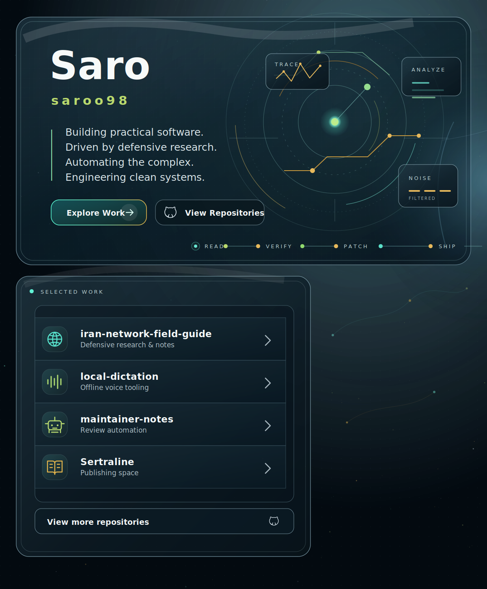

  

# Saro / saroo98

Building practical software. Driven by defensive research. Automating the complex. Engineering clean systems.

[Explore work](#selected-work) · [View repositories](https://github.com/saroo98?tab=repositories)

## Selected Work

- [iran-network-field-guide](https://github.com/saroo98/iran-network-field-guide): Defensive research and notes.
- [local-dictation](https://github.com/saroo98/local-dictation): Offline voice tooling.
- [maintainer-notes](https://github.com/saroo98/maintainer-notes): Review automation.
- [Sertraline](https://github.com/saroo98/Sertraline): Publishing space.

  

