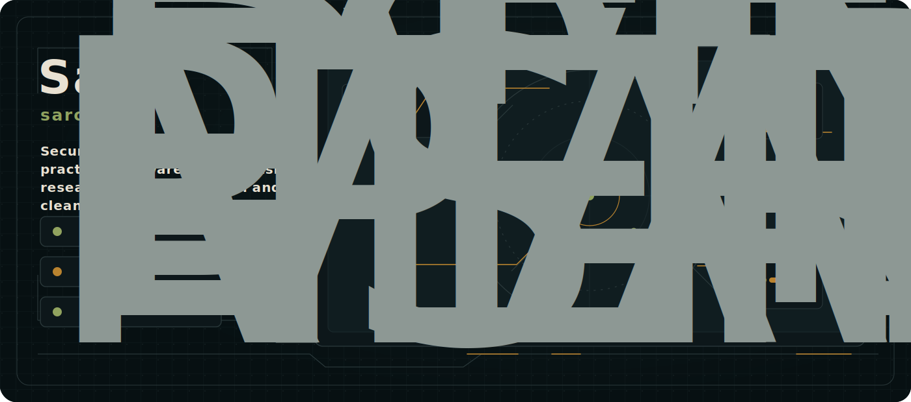
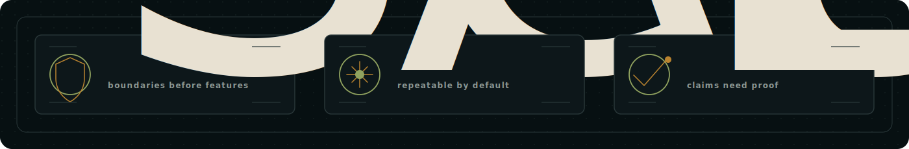
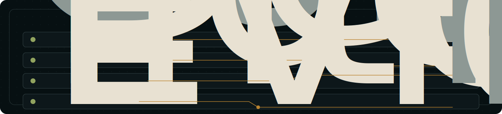
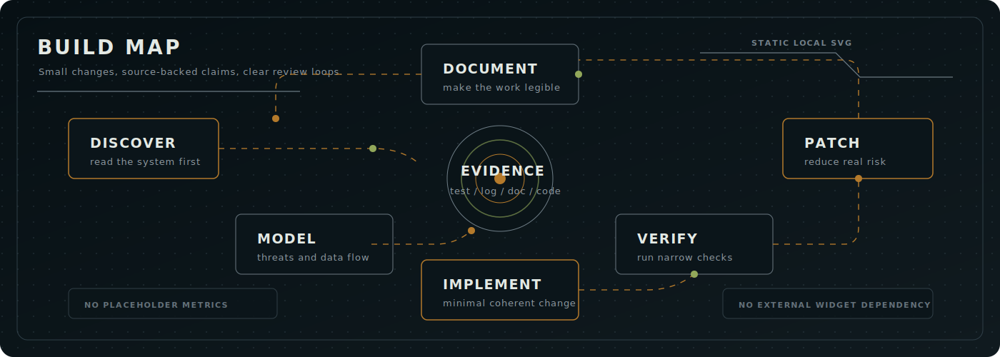
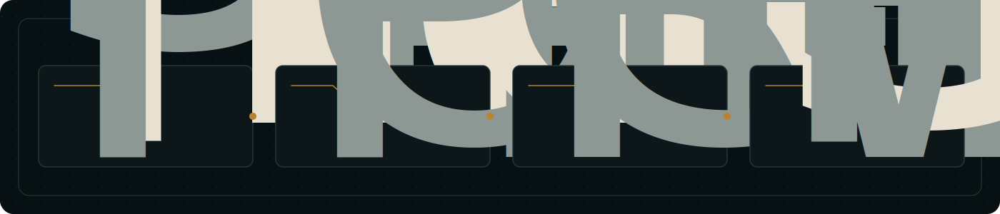
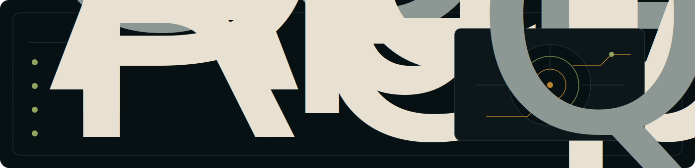

# Saro / saroo98

Security-minded builder focused on practical software, defensive research, automation, and clean engineering systems.

I care about small, verifiable changes: clear boundaries, repeatable checks, readable interfaces, and evidence before claims.

## Signal Brief

- **Secure by design:** authentication boundaries, input handling, logging, and data exposure are engineering decisions from the start.
- **Automation-first:** repeatable workflows, small scripts, and clear failure modes beat manual heroics.
- **Evidence-driven:** repository code, type definitions, logs, tests, docs, and command output matter more than claims.

## Current Focus

- **Defensive engineering:** authentication boundaries, input handling, logging, data exposure, and patch review.
- **Local-first tooling:** small utilities, automation, privacy-preserving workflows, and useful defaults.
- **Interface craft:** READMEs, GitHub profiles, product surfaces, and technical presentation.
- **Evidence loops:** tests, docs, logs, command output, and repository code.

## Build Map

The loop is simple: understand the system, make the smallest coherent change, verify it, document it, and patch what real evidence exposes.

## Selected Work

- [iran-network-field-guide](https://github.com/saroo98/iran-network-field-guide): field guide for VPN connectivity testing and censorship-resilience research.
- [local-dictation](https://github.com/saroo98/local-dictation): offline Windows dictation bubble with faster-whisper and privacy-first voice typing.
- [maintainer-notes](https://github.com/saroo98/maintainer-notes): GitHub Action for maintainer-focused pull request review notes.
- [Sertraline](https://github.com/saroo98/Sertraline): personal publishing space for keeping writing and technical work visible.

## Collaboration

Good fits:

- Defensive application review and patching
- Automation for developer workflows
- Privacy-first local tooling and developer workflow systems
- README, profile, and repository presentation work

The fastest path is a GitHub conversation on the relevant repository or profile.

