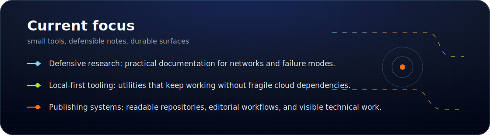

<!--
GitHub controls the surrounding page theme. This README uses self-contained SVG panels
so the profile stays visually stable in GitHub light and dark mode.
-->

  

  
  
  

  

  

## Selected work

  
  

  
  

  

  

  

## Profile signals

  

  

