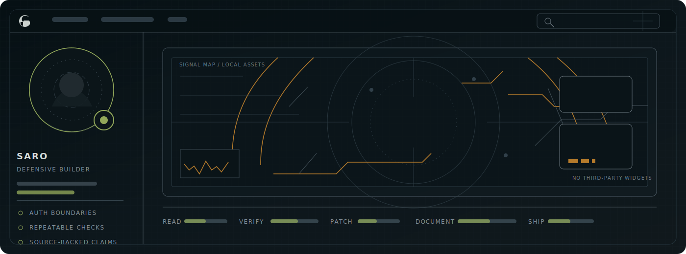

<picture>
  <source media="(prefers-color-scheme: dark)" srcset="assets/signal-console-dark.svg">
  <source media="(prefers-color-scheme: light)" srcset="assets/signal-console-light.svg">
  
</picture>

# Saro / saroo98

Security-minded builder focused on practical software, defensive research, automation, and clean engineering systems.

I care about small, verifiable changes: clear boundaries, repeatable checks, readable interfaces, and evidence before claims.

## Signal Brief

- **Secure by design.** I treat authentication, input boundaries, logging, and data exposure as first-class engineering decisions.
- **Automation-first.** I prefer repeatable workflows, small scripts, and clear failure modes over manual heroics.
- **Evidence-driven.** I verify with repository code, type definitions, logs, tests, docs, and actual command output.

## Current Focus

| Track | What I am building toward | Signal |
| --- | --- | --- |
| Defensive engineering | Safer application behavior, threat-aware review, and patch-focused research | Security posture |
| Automation systems | Scripts, pipelines, and repeatable workflows that remove manual drag | Operational clarity |
| Local-first tooling | Privacy-aware utilities, desktop workflows, and practical scripts that stay close to the machine | Useful defaults |
| Interface craft | GitHub profiles, READMEs, and product surfaces that make technical work easier to scan | Stronger first impression |

## Build Map

## Selected Work

| Slot | Evidence to add | Link |
| --- | --- | --- |
| Field research | Public field guide for VPN connectivity testing, censorship-resilience research, and safe route-family measurement | [iran-network-field-guide](https://github.com/saroo98/iran-network-field-guide) |
| Local-first tooling | Offline Windows dictation bubble with faster-whisper, CUDA-first transcription, clipboard paste, and privacy-first voice typing | [local-dictation](https://github.com/saroo98/local-dictation) |
| Maintainer automation | GitHub Action that adds maintainer-focused review notes to pull requests | [maintainer-notes](https://github.com/saroo98/maintainer-notes) |
| Personal publishing | Blog and writing space for keeping technical work visible and organized | [Sertraline](https://github.com/saroo98/Sertraline) |

## Collaboration

Good fits:

- Defensive application review and patching
- Automation for developer workflows
- Privacy-first local tooling and developer workflow systems
- README, profile, and repository presentation work

The fastest path is a GitHub conversation on the relevant repository or profile: [github.com/saroo98](https://github.com/saroo98).

